# **Finding Lane Lines on the Road**

---

The goals / steps of this project are the following:
* Make a pipeline that finds lane lines on the road
* Reflect on your work in a written report

---

### Reflection

##### 1. Describe your pipeline. As part of the description, explain how you modified the draw_lines() function.

My pipeline is the following:

1. Convert RGB to grayscale

2. Convert RGB to HSV

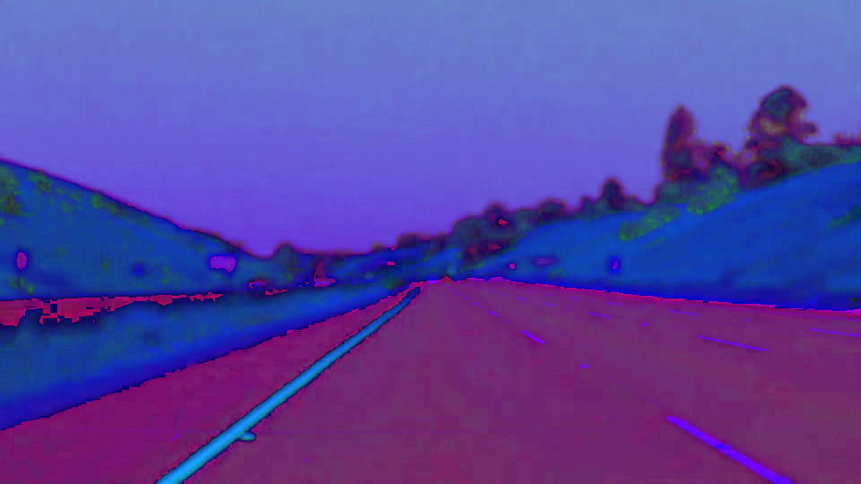

3. Extract yellow in HSV to produce a yellow mask

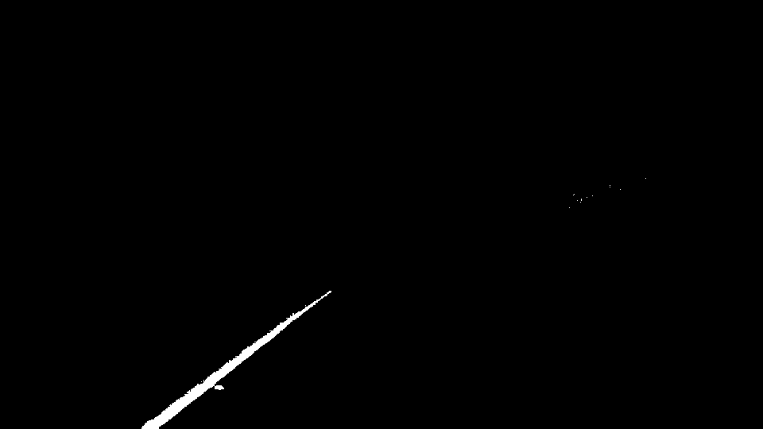

4. Extract white in HSV to produce a white mask

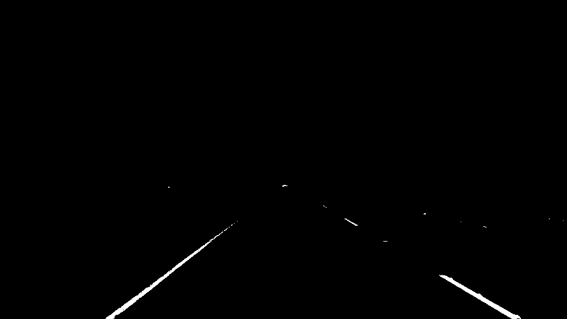

5. Combine the yellow and white masks

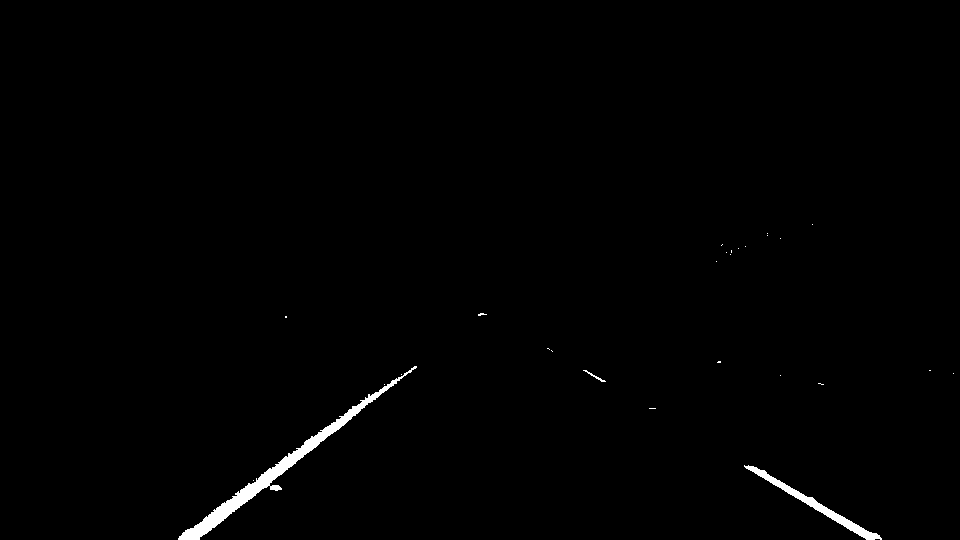

6. Reduce contrast in grayscale

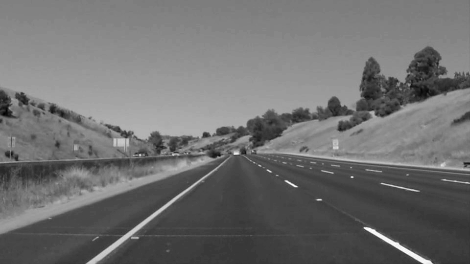

7. Apply the combined mask to grayscale to boost the lane lines

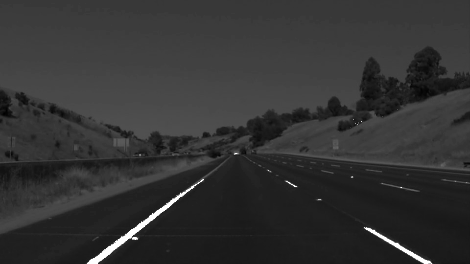

8. Apply Gaussian blur to reduce the noise

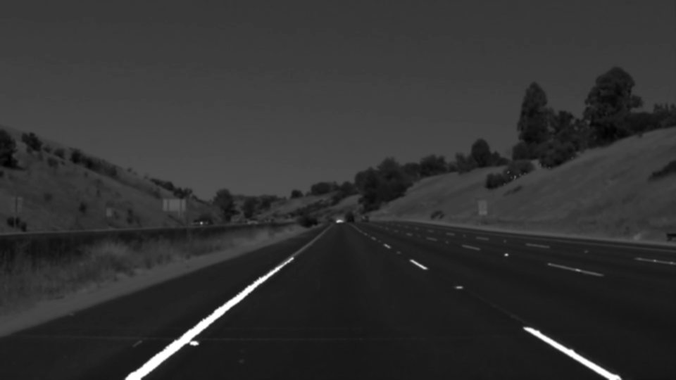

9. Perform Canny edge detection

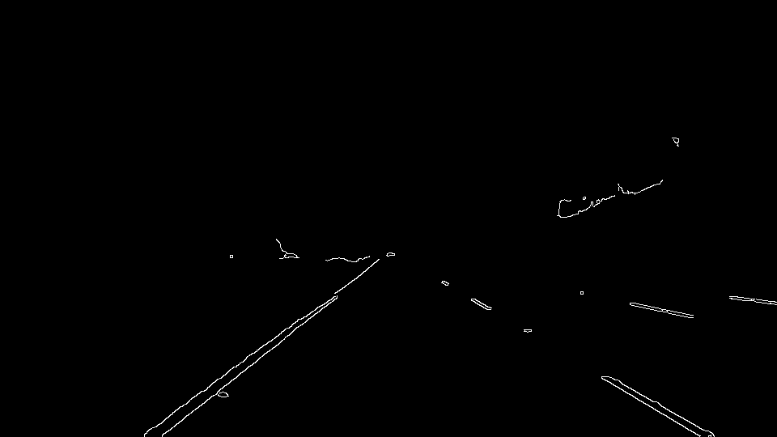

10. Define a region of interest, produce a mask and apply it to remove the unimportant areas

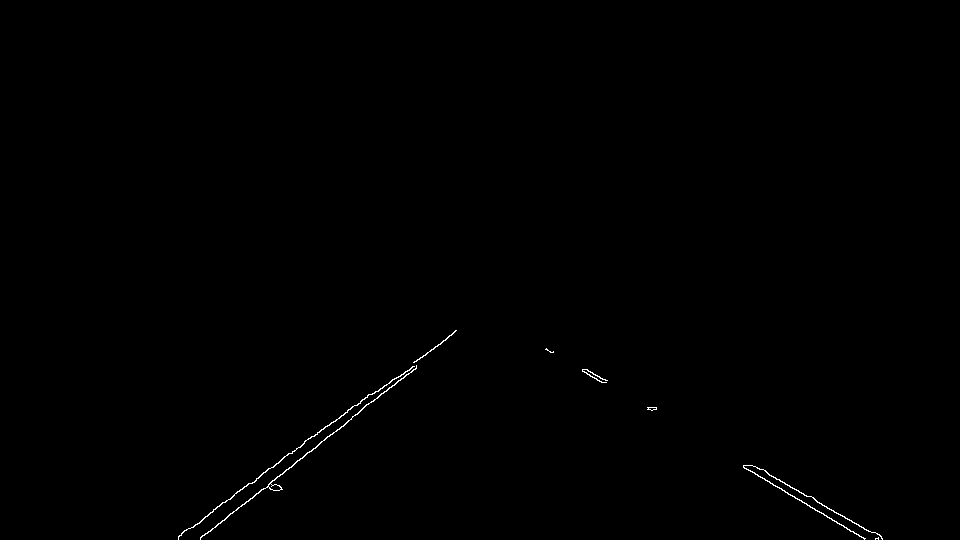

11. Perform Hough transform

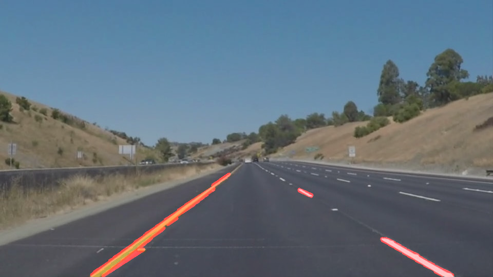

12. Average/extrapolate lines and apply them to the original RGB image

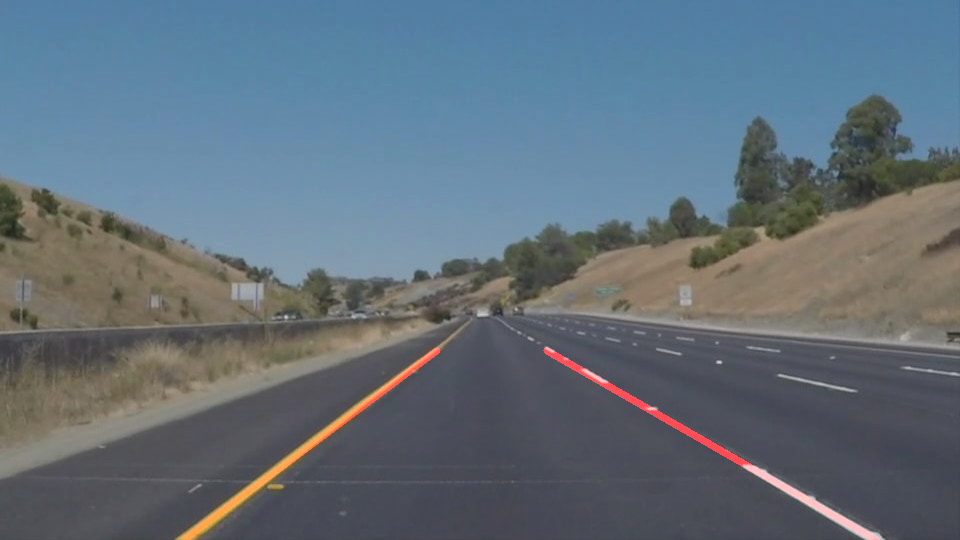

 

To average/extrapolate lines, I modified the `draw_lines()` (technically, I made a new function called `draw_extrapolated_lines()`) in the following steps:

1. Get lines (sets of coordinates [x1, y1, x2, y2]) and compute the slopes
2. Take care of the lines as right line or left line depending on the slopes and the coordinates
3. Fit the line for each side (right and left) using `np.polyfit()`
4. Draw the lines on the original RGB image

 

##### 2. Identify potential shortcomings with your current pipeline

The potential shortcoming:

* The algorithm is not generalized/robust which means it is vulnerable to other situations such as raining, night, snowing, etc...

 

##### 3. Suggest possible improvements to your pipeline

The possible improvements:

* More careful parameter tuning to improve the result a bit more
* Extrapolate not straight lines, but curvy lines to fit the lane lines better
* Use machine learning/deep learning methods for the algorithm to be more generalized/robust
